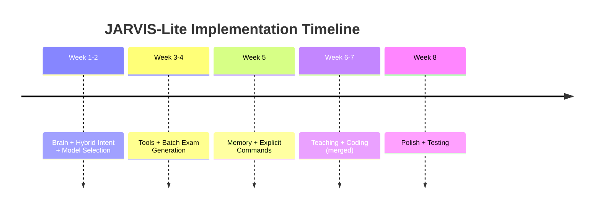

# 📋 JARVIS-Lite Complete Overview

> Master index and navigation guide for all architecture documents

**Date**: April 7, 2026  
**Status**: Ready to Implement  
**Duration**: 9 weeks to production Windows application

---

## 📚 Document Index

### 1. **Quick Start**
👉 **Read first**: [JARVIS_LITE_QUICK_REFERENCE.md](JARVIS_LITE_QUICK_REFERENCE.md)
- 1-page executive summary
- What you're building
- Timeline + MVP definition
- FAQ

**Time to read**: 5 minutes

---

### 2. **System Design**
👉 **Read second**: [JARVIS_LITE_ARCHITECTURE.md](JARVIS_LITE_ARCHITECTURE.md)
- Complete architecture
- Brain, Skills, Tools, Memory layers
- Code examples
- Performance profiles
- Project structure

**Time to read**: 15 minutes

---

### 3. **Implementation Plan**
👉 **Read third**: [JARVIS_LITE_INTEGRATION_ROADMAP.md](JARVIS_LITE_INTEGRATION_ROADMAP.md)
- Phase-by-phase breakdown
- Week-by-week tasks
- Success criteria for each phase
- Test checklists
- Integration with PHASE 1

**Time to read**: 20 minutes  
**Use during**: Development (reference constantly)

---

### 4. **Decision Context**
👉 **Read last**: [COMPARISON_APPROACHES.md](COMPARISON_APPROACHES.md)
- Why pragmatic approach over ambitious
- Risk analysis
- Resource comparison
- Future roadmap after MVP

**Time to read**: 10 minutes  
**Use when**: Considering pivoting or expanding scope

---

## 🎯 Quick Navigation

### I want to...

**... understand what JARVIS-Lite is**
→ [JARVIS_LITE_QUICK_REFERENCE.md](JARVIS_LITE_QUICK_REFERENCE.md) (section "What Is JARVIS-Lite?")

**... see the full architecture**
→ [JARVIS_LITE_ARCHITECTURE.md](JARVIS_LITE_ARCHITECTURE.md) (section "System Architecture")

**... understand how to build it**
→ [JARVIS_LITE_INTEGRATION_ROADMAP.md](JARVIS_LITE_INTEGRATION_ROADMAP.md)

**... know what PHASE 1 provides**
→ [PHASE_1_INTEGRATION.md](PHASE_1_INTEGRATION.md)

**... understand the 3 layers**
→ [JARVIS_LITE_ARCHITECTURE.md](JARVIS_LITE_ARCHITECTURE.md) (section "Brain Layer" + "Tools Layer" + "Memory Layer")

**... see the skills system**
→ [JARVIS_LITE_ARCHITECTURE.md](JARVIS_LITE_ARCHITECTURE.md) (section "Skills System")

**... understand intent detection**
→ [JARVIS_LITE_ARCHITECTURE.md](JARVIS_LITE_ARCHITECTURE.md) (section "Intent Detection")

**... see the project structure**
→ [JARVIS_LITE_ARCHITECTURE.md](JARVIS_LITE_ARCHITECTURE.md) (section "Project Structure")

**... know what each phase delivers**
→ [JARVIS_LITE_INTEGRATION_ROADMAP.md](JARVIS_LITE_INTEGRATION_ROADMAP.md) (section "Phase-by-Phase Roadmap")

**... see the timeline**
→ [JARVIS_LITE_QUICK_REFERENCE.md](JARVIS_LITE_QUICK_REFERENCE.md) (section "9-Week Timeline")

**... understand why this approach**
→ [COMPARISON_APPROACHES.md](COMPARISON_APPROACHES.md)

**... understand what's in MVP**
→ [JARVIS_LITE_QUICK_REFERENCE.md](JARVIS_LITE_QUICK_REFERENCE.md) (section "MVP Definition")

**... see what PHASE 1 gave us**
→ [JARVIS_LITE_INTEGRATION_ROADMAP.md](JARVIS_LITE_INTEGRATION_ROADMAP.md) (section "Integration with PHASE 1")

---

## 🏗️ Architecture Layers (Visual)

```
Layer 4: Interface
┌─────────────────────────────┐
│  CLI Chat / Voice (optional)│
└──────────────┬──────────────┘
               
Layer 3: Brain
┌─────────────────────────────┐
│  Reasoning Loop             │
│  Intent Detection           │
│  Skill Selection            │
└──────────────┬──────────────┘
               
Layer 2: Skills & Tools
┌─────────────────────────────┐
│  Teaching | Coding | Tools  │
│  Exam | Debug | Search/Run  │
└──────────────┬──────────────┘
               
Layer 1: Foundation (PHASE 1)
┌─────────────────────────────┐
│  OllamaEngine (local models)│
│  MemoryManager (SQLite)     │
└─────────────────────────────┘
```

---

## 📊 Key Concepts

### 1. Intent Detection
**What**: Pattern-based categorization of user input  
**Purpose**: Route to correct skill (exam vs code vs teach)  
**Performance**: <1ms, rules-based (no ML)  
**Examples**: "generate exam" → teaching, "debug code" → coding  
→ [Details](JARVIS_LITE_ARCHITECTURE.md#-intent-detection-rules-based)

### 2. Skills System
**What**: Domain knowledge as JSON files + prompts  
**Purpose**: Reusable intelligence (add skills easily)  
**Extension**: Just create new JSON file  
**Example**: teaching/generate_exam.json →[Details](JARVIS_LITE_ARCHITECTURE.md#-skills-system-reusable-intelligence)

### 3. Tools Layer
**What**: Sandboxed execution (read files, run code, format text)  
**Purpose**: LLM can call tools to execute actions  
**Safety**: Restricted directories, allowed operations only  
→ [Details](JARVIS_LITE_ARCHITECTURE.md#-tools-layer-execution)

### 4. Memory System
**What**: SQLite database + user profile JSON  
**Purpose**: Remember conversations, learn preferences  
**Learning**: Corrections update profile automatically  
→ [Details](JARVIS_LITE_ARCHITECTURE.md#-memory-layer-learning)

### 5. Sandboxing
**What**: Restrict tool execution to safe operations  
**Purpose**: Can't break system even if code is wrong  
**Implementation**: Whitelist of allowed directories + operations  
→ [Details](JARVIS_LITE_ARCHITECTURE.md#-tools-layer-execution)

---

## 🕐 Phase Timeline



---

## 📈 Feature Rollout by Phase

| Phase | Weeks | New Skills | Result |
|-------|-------|-----------|--------|
| **2** | 1-2 | Chat, Teach Concept, Code Debug | Can talk to JARVIS |
| **3** | 3-4 | Exam Gen, Code Tools | Can generate exams |
| **4** | 5-6 | Memory, Personalization | Learns from feedback |
| **5** | 7 | Full Teaching Suite | Professional exams |
| **6** | 8 | Full Code Suite | Full code assistant |

---

## ✅ Success Criteria by Phase

### PHASE 2 (Brain & Intent)
- [ ] Brain reasoning loop works
- [ ] Intent detection >90% accurate
- [ ] Memory stores conversations
- [ ] Can chat on 4GB RAM

### PHASE 3 (Tools)
- [ ] Tools are sandboxed
- [ ] Exam generation works
- [ ] Code debugging works
- [ ] No memory leaks

### PHASE 4 (Memory)
- [ ] Profile learns 3+ preferences
- [ ] Personalization affects responses
- [ ] Memory queries <10ms

### PHASE 5 (Teaching)
- [ ] Generate 20-50 questions in 10-20s
- [ ] Questions are pedagogically sound
- [ ] Format matches user preference

### PHASE 6 (Coding)
- [ ] Identifies real bugs
- [ ] Explanations are clear
- [ ] Generated functions work

---

## 🔗 Integration with PHASE 1

```python
# PHASE 1 Foundation (✅ Already Done)
from providers.local import OllamaEngine
from providers.local.memory_storage import MemoryManager

# JARVIS-Lite Uses Both
class JARVISBrain:
    def __init__(self):
        self.model = OllamaEngine(model="phi-2")  # From PHASE 1
        self.memory = MemoryManager()              # From PHASE 1
        
    # Plus new layers:
        self.skills = SkillLoader()               # NEW
        self.intent_detector = IntentDetector()   # NEW
        self.tools = ToolRunner()                 # NEW
```

→ [Full details](JARVIS_LITE_INTEGRATION_ROADMAP.md#-integration-with-phase-1)

---

## 🎯 MVP Definition

**JARVIS-Lite v1.0 is complete when:**

Core:
- ✅ Runs on 4GB RAM
- ✅ Brain reasoning loop solid
- ✅ Intent detection works
- ✅ Memory stores conversations

Features:
- ✅ Generates exam questions (20-50 in 10-20s)
- ✅ Debugs code
- ✅ Learns from corrections
- ✅ All skills tested

Quality:
- ✅ No crashes
- ✅ <15s first response, <5s after
- ✅ Works 100% offline
- ✅ Documentation complete

→ [Full details](JARVIS_LITE_QUICK_REFERENCE.md#-mvp-definition)

---

## 📊 Performance Profile

| Operation | Time | Offline? |
|-----------|------|----------|
| Intent detection | <1ms | ✅ |
| Memory lookup | <10ms | ✅ |
| File search | <500ms | ✅ |
| First response | 8-15s | ✅ |
| Subsequent responses | 3-5s | ✅ |
| Voice input (if enabled) | +3-4s | ✅ |

→ [Full details](JARVIS_LITE_ARCHITECTURE.md#⚡-performance-profile)

---

## 🚀 Post-MVP Roadmap

Once MVP ships (week 8+):

**Month 2**: User feedback + Polish  
- Better question formats
- More coding languages
- Improved explanations

**Month 3**: Voice Interface  
- Voice input (Vosk)
- Voice output (Coqui TTS)
- Voice commands work offline

**Month 4**: Advanced Features  
- Federated learning
- Smart caching
- Multi-device awareness

**Month 5+**: Enterprise  
- P2P mesh networking (if demand)
- Task queuing (if needed)
- Community skill registry

→ [Full roadmap](JARVIS_LITE_INTEGRATION_ROADMAP.md#-post-mvp-roadmap)

---

## 🎓 Skills You'll Have

After building JARVIS-Lite, you'll understand:
- LLM reasoning loops
- Prompt engineering
- Skill-based system design
- Memory management
- Tool execution & sandboxing
- Personalization algorithms
- Testing AI systems
- Releasing open source

---

## 💡 Design Principles

1. **Lean**: Only build what's needed
2. **Offline**: No internet dependency
3. **Private**: All data stays local
4. **Modular**: Easy to add/remove skills
5. **Simple**: Anyone can extend it
6. **Testable**: High code coverage
7. **Documented**: Clear documentation

---

## 🗂️ File Structure

```
c:/Users/johnr/OneDrive/Desktop/Websites 2026/free-claude-code/
├── JARVIS_LITE_QUICK_REFERENCE.md      ← Start here
├── JARVIS_LITE_ARCHITECTURE.md          ← Design study
├── JARVIS_LITE_INTEGRATION_ROADMAP.md   ← Implementation guide
├── COMPARISON_APPROACHES.md             ← Decision context
├── PHASE_1_INTEGRATION.md               ← What we built
├── INTEGRATION_ROADMAP.md               ← Original ambitious vision
└── jarvis-lite/                         ← Code directory (to be created)
    ├── jarvis.py
    ├── brain/
    ├── skills/
    ├── tools/
    ├── memory/
    ├── config/
    └── tests/
```

---

## 🚦 Decision Points

### Should I use this approach?

✅ **Yes, if:**
- You want to ship something this quarter
- You're 1-2 people building this
- You want to validate ideas with users
- You care about practicality over perfection
- You like iterating based on feedback

❌ **No, if:**
- You have unlimited time/budget
- You need 10 features from day 1
- You're building for a known use case
- You want complete architecture before coding

**For JARVIS-Lite: This is the right approach**

---

## 📞 Questions?

**Q: Where do I start?**  
A: Read [JARVIS_LITE_QUICK_REFERENCE.md](JARVIS_LITE_QUICK_REFERENCE.md) (5 min)

**Q: How do I build it?**  
A: Follow [JARVIS_LITE_INTEGRATION_ROADMAP.md](JARVIS_LITE_INTEGRATION_ROADMAP.md) (phase-by-phase)

**Q: What's the full design?**  
A: See [JARVIS_LITE_ARCHITECTURE.md](JARVIS_LITE_ARCHITECTURE.md)

**Q: Why this approach?**  
A: Read [COMPARISON_APPROACHES.md](COMPARISON_APPROACHES.md)

**Q: What did PHASE 1 give us?**  
A: See [PHASE_1_INTEGRATION.md](PHASE_1_INTEGRATION.md)

---

## ⏱️ Time Estimate

| Activity | Time |
|----------|------|
| Read all docs | 1 hour |
| Start PHASE 2 | 2 weeks |
| Complete PHASE 7 | 7 weeks total (core MVP complete) |
| Add GUI (PHASE 8) | Week 8 |
| Add Packaging (PHASE 9) | Week 9 |
| Polish + testing | 2 weeks |
| Launch MVP | Week 10 |

---

## 🎯 Your Next Action

1. **Read**: [JARVIS_LITE_QUICK_REFERENCE.md](JARVIS_LITE_QUICK_REFERENCE.md) (5 min)
2. **Study**: [JARVIS_LITE_ARCHITECTURE.md](JARVIS_LITE_ARCHITECTURE.md) (15 min)
3. **Plan**: [JARVIS_LITE_INTEGRATION_ROADMAP.md](JARVIS_LITE_INTEGRATION_ROADMAP.md) (20 min)
4. **Code**: Start PHASE 2 (brain layer)

**Total prep time**: 40 minutes  
**Total build time**: 9 weeks (7 weeks core + 2 weeks GUI + packaging)

---

## 📚 Document Versions

| Document | Version | Status |
|----------|---------|--------|
| JARVIS_LITE_QUICK_REFERENCE.md | 1.0 | ✅ FINAL |
| JARVIS_LITE_ARCHITECTURE.md | 1.0 | ✅ FINAL |
| JARVIS_LITE_INTEGRATION_ROADMAP.md | 1.0 | ✅ FINAL |
| COMPARISON_APPROACHES.md | 1.0 | ✅ FINAL |
| PHASE_1_INTEGRATION.md | 1.0 | ✅ FINAL |

---

**Status**: ALL DOCUMENTS COMPLETE  
**Date**: April 7, 2026  
**Ready to**: Start PHASE 2 Implementation  

👉 **Next**: Begin [PHASE 2: Brain & Intent Detection](JARVIS_LITE_INTEGRATION_ROADMAP.md#phase-2-brain--intent-detection-weeks-1-2)

